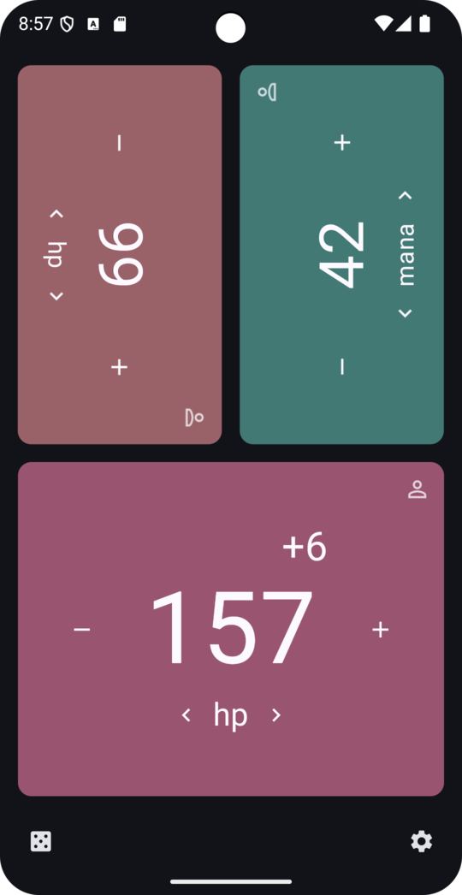

> [!CAUTION]
> This app is NOT available on google play. [Get it on F-Droid](https://f-droid.org/packages/net.multun.gamecounter.fdroid/).
> Use the google play counterfeit at your own risk: it's laced with adds, obsolete, and source is not available.

<p align="center">
    
</p>

An app for counting points at board, card, or role playing games:
 - keep track of multiple counters per player
 - customizable counter name and initial value
 - long press plus or minus for quick updates
 - players can change card colors
 - roll dices of any size, or pick player order

[](https://f-droid.org/packages/net.multun.gamecounter.fdroid/)

# Preview

<p align="center">
    
</p>

# Build

```sh
# build a signed debug package
./gradlew assembleDevRelease // or assembleDevDebug
```

# Install

```sh
adb install ./app/build/outputs/apk/dev/release/app-dev-release.apk
```
